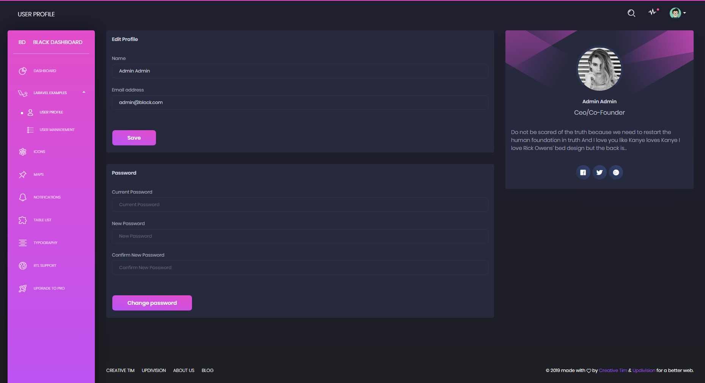
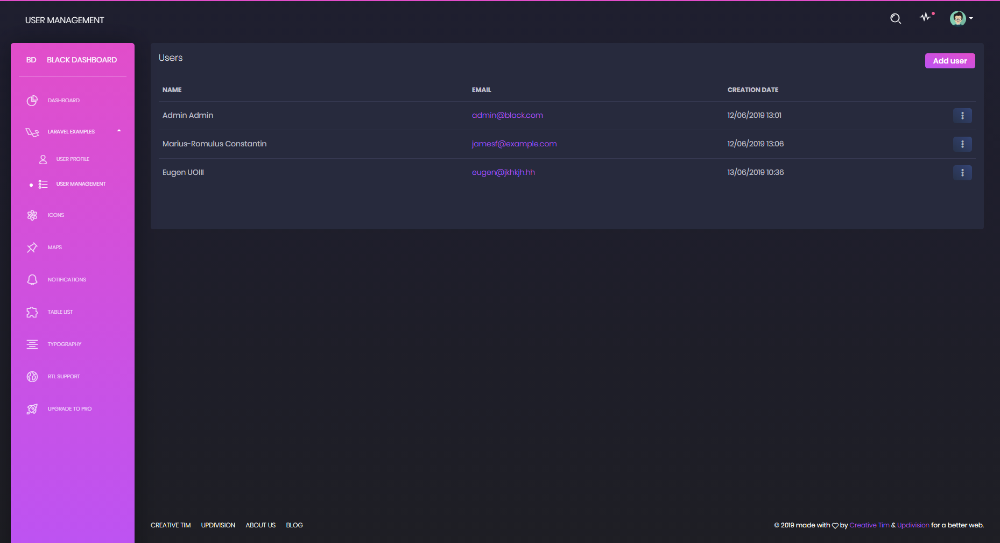

# [Black Dashboard Laravel - Free Frontend Preset for Laravel](https://www.creative-tim.com/live/black-dashboard-laravel/?ref=bdl-readme) [](https://twitter.com/home?status=Black%20Dashboard%20Laravel%20is%20a%20Free%20Frontend%20Preset%20for%20Laravel%20%E2%9D%A4%EF%B8%8F%0Ahttps%3A//www.creative-tim.com/live/black-dashboard-laravel%20%23%black%20%23design%20%23dashboard%20%23laravel%20%23free%20via%20%40CreativeTim)

  [](https://github.com/laravel-frontend-presets/black-dashboard/issues?q=is%3Aopen+is%3Aissue) [](https://github.com/laravel-frontend-presets/black-dashboard/issues?q=is%3Aissue+is%3Aclosed)

*Frontend version*: Black Dashboard v1.0.0. More info at https://www.creative-tim.com/product/black-dashboard


Speed up your web development with the Bootstrap 4 Admin Dashboard built for Laravel Framework 8.x and up.

## Note

We recommend installing this preset on a project that you are starting from scratch, otherwise your project's design might break.

## Prerequisites

If you don't already have an Apache local environment with PHP and MySQL, use one of the following links:

 - Windows: https://updivision.com/blog/post/beginner-s-guide-to-setting-up-your-local-development-environment-on-windows
 - Linux: https://howtoubuntu.org/how-to-install-lamp-on-ubuntu
 - Mac: https://wpshout.com/quick-guides/how-to-install-mamp-on-your-mac/

Also, you will need to install Composer: https://getcomposer.org/doc/00-intro.md

And Laravel: https://laravel.com/docs/8.x/installation

## Installation

After initializing a fresh instance of Laravel (and making all the necessary configurations), install the preset using one of the provided methods:

### Via composer

1. `Cd` to your Laravel app  
2. Type in your terminal: `composer require laravel/ui` and `php artisan ui vue --auth`
2. Install this preset via `composer require laravel-frontend-presets/black-dashboard`. No need to register the service provider. Laravel 5.5 & up can auto detect the package.
3. Run `php artisan ui black` command to install the Argon preset. This will install all the necessary assets and also the custom auth views, it will also add the auth route in `routes/web.php`
(NOTE: If you run this command several times, be sure to clean up the duplicate Auth entries in routes/web.php)
4. In your terminal run `composer dump-autoload`
5. Run `php artisan migrate --seed` to create basic users table

### By using the archive

1. In your application's root create a **presets** folder
2. [Download an archive](https://github.com/laravel-frontend-presets/black-dashboard/archive/master.zip) of the repo and unzip it
3. Copy and paste **black-dashboard-master** folder in presets (created in step 2) and rename it to **black**
4. Open `composer.json` file 
5. Add `"LaravelFrontendPresets\\BlackPreset\\": "presets/black/src"` to `autoload/psr-4` and to `autoload-dev/psr-4`
6. Add `LaravelFrontendPresets\BlackPreset\BlackPresetServiceProvider::class` to `config/app.php` file
7. Type in your terminal: `composer require laravel/ui` and `php artisan ui vue --auth`
8. In your terminal run `composer dump-autoload`
9. Run `php artisan ui black` command to install the Black Dashboard preset. This will install all the necessary assets and also the custom auth views, it will also add the auth route in `routes/web.php`
(NOTE: If you run this command several times, be sure to clean up the duplicate Auth entries in routes/web.php)
10. Run `php artisan migrate --seed` to create basic users table


## Usage

Register a user or login using **admin@black.com** and **secret** and start testing the preset (make sure to run the migrations and seeders for these credentials to be available).

Besides the dashboard and the auth pages this preset also has an edit profile page. All the necessary files (controllers, requests, views) are installed out of the box and all the needed routes are added to `routes/web.php`. Keep in mind that all of the features can be viewed once you login using the credentials provided above or by registering your own user. 

### Dashboard

You can access the dashboard either by using the "**Dashboard**" link in the left sidebar or by adding **/home** in the url. 

### Profile edit

You have the option to edit the current logged in user's profile (change name, email and password). To access this page just click the "**User profile**" link in the left sidebar or by adding **/profile** in the url.

The `App\Http\Controllers\ProfileController` handles the update of the user information. 

```
public function update(ProfileRequest $request)
{
    auth()->user()->update($request->all());

    return back()->withStatus(__('Profile successfully updated.'));
}
```

Also you shouldn't worry about entering wrong data in the inputs when editing the profile, validation rules were added to prevent this (see `App\Http\Requests\ProfileRequest`). If you try to change the password you will see that other validation rules were added in `App\Http\Requests\PasswordRequest`. Notice that in this file you have a custom validation rule that can be found in `App\Rules\CurrentPasswordCheckRule`.

```
public function rules()
{
    return [
        'old_password' => ['required', 'min:6', new CurrentPasswordCheckRule],
        'password' => ['required', 'min:6', 'confirmed', 'different:old_password'],
        'password_confirmation' => ['required', 'min:6'],
    ];
}
```
## Table of Contents

* [Versions](#versions)
* [Demo](#demo)
* [Documentation](#documentation)
* [File Structure](#file-structure)
* [Browser Support](#browser-support)
* [Resources](#resources)
* [Reporting Issues](#reporting-issues)
* [Licensing](#licensing)
* [Useful Links](#useful-links)

## Versions

[](https://demos.creative-tim.com/argon-dashboard-pro/pages/dashboards/dashboard.html?ref=bdl-readme)
[](https://argon-dashboard-pro-laravel.creative-tim.com/?ref=bdl-readme)

| HTML | LARAVEL |
| --- | --- |
| [](https://demos.creative-tim.com/black-dashboard/examples/dashboard.html?ref=bdl-readme) | [](https://www.creative-tim.com/live/black-dashboard-laravel?ref=bdl-readme)

## Demo

| Register | Login | Dashboard |
| --- | --- | ---  |
| [](https://black-dashboard-laravel.creative-tim.com/register?ref=bdl-readme)  | [](https://black-dashboard-laravel.creative-tim.com/login?ref=bdl-readme)  | [](https://www.creative-tim.com/live/black-dashboard-laravel/?ref=bdl-readme)

| Profile Page | Users Page | Tables Page  |
| --- | --- | ---  |
| [](https://black-dashboard-laravel.creative-tim.com/profile?ref=bdl-readme)  | [](https://black-dashboard-laravel.creative-tim.com/user?ref=bdl-readme) | [](https://black-dashboard-laravel.creative-tim.com/tables?ref=bdl-readme)
[View More](https://www.creative-tim.com/live/black-dashboard-laravel/?ref=bdl-readme)

## Documentation
The documentation for the Black Dashboard Laravel is hosted at our [website](https://black-dashboard-laravel.creative-tim.com/docs/getting-started/laravel-setup.html?ref=bdl-readme).

## File Structure
```
├───app
│   ├───Http
│   │   ├───Controllers
│   │   │       HomeController.php
│   │   │       PageController.php
│   │   │       ProfileController.php
│   │   │       UserController.php
│   │   │       
│   │   └───Requests
│   │           PasswordRequest.php
│   │           ProfileRequest.php
│   │           UserRequest.php
│   │           
│   └───Rules
│           CurrentPasswordCheckRule.php
│           
├───database
│   └───seeds
│           DatabaseSeeder.php
│           UsersTableSeeder.php
│           
└───resources
    ├───assets
    │   ├───css
    │   │       black-dashboard.css
    │   │       black-dashboard.css.map
    │   │       black-dashboard.min.css
    │   │       nucleo-icons.css
    │   │       theme.css
    │   │       
    │   ├───demo
    │   │       demo.css
    │   │       demo.js
    │   │       
    │   ├───fonts
    │   │       nucleo.eot
    │   │       nucleo.ttf
    │   │       nucleo.woff
    │   │       nucleo.woff2
    │   │       
    │   ├───img
    │   │       anime3.png
    │   │       anime6.png
    │   │       apple-icon.png
    │   │       bg5.jpg
    │   │       card-primary.png
    │   │       default-avatar.png
    │   │       emilyz.jpg
    │   │       favicon.png
    │   │       header.jpg
    │   │       img_3115.jpg
    │   │       james.jpg
    │   │       mike.jpg
    │   │       
    │   ├───js
    │   │   │   black-dashboard.js
    │   │   │   black-dashboard.js.map
    │   │   │   black-dashboard.min.js
    │   │   │   theme.js
    │   │   │   
    │   │   ├───core
    │   │   │       bootstrap.min.js
    │   │   │       jquery.min.js
    │   │   │       popper.min.js
    │   │   │       
    │   │   └───plugins
    │   │           bootstrap-notify.js
    │   │           chartjs.min.js
    │   │           perfect-scrollbar.jquery.min.js
    │   │           
    │   └───scss
    │       │   black-dashboard.scss
    │       │   
    │       └───black-dashboard
    │           ├───bootstrap
    │           │   │   _alert.scss
    │           │   │   _badge.scss
    │           │   │   _breadcrumb.scss
    │           │   │   _button-group.scss
    │           │   │   _buttons.scss
    │           │   │   _card.scss
    │           │   │   _carousel.scss
    │           │   │   _close.scss
    │           │   │   _code.scss
    │           │   │   _custom-forms.scss
    │           │   │   _dropdown.scss
    │           │   │   _forms.scss
    │           │   │   _functions.scss
    │           │   │   _grid.scss
    │           │   │   _images.scss
    │           │   │   _input-group.scss
    │           │   │   _jumbotron.scss
    │           │   │   _list-group.scss
    │           │   │   _media.scss
    │           │   │   _mixins.scss
    │           │   │   _modal.scss
    │           │   │   _nav.scss
    │           │   │   _navbar.scss
    │           │   │   _pagination.scss
    │           │   │   _popover.scss
    │           │   │   _print.scss
    │           │   │   _progress.scss
    │           │   │   _reboot.scss
    │           │   │   _root.scss
    │           │   │   _tables.scss
    │           │   │   _tooltip.scss
    │           │   │   _transitions.scss
    │           │   │   _type.scss
    │           │   │   _utilities.scss
    │           │   │   _variables.scss
    │           │   │   
    │           │   ├───mixins
    │           │   │       _alert.scss
    │           │   │       _background-variant.scss
    │           │   │       _badge.scss
    │           │   │       _border-radius.scss
    │           │   │       _box-shadow.scss
    │           │   │       _breakpoints.scss
    │           │   │       _buttons.scss
    │           │   │       _caret.scss
    │           │   │       _clearfix.scss
    │           │   │       _float.scss
    │           │   │       _forms.scss
    │           │   │       _gradients.scss
    │           │   │       _grid-framework.scss
    │           │   │       _grid.scss
    │           │   │       _hover.scss
    │           │   │       _image.scss
    │           │   │       _list-group.scss
    │           │   │       _lists.scss
    │           │   │       _nav-divider.scss
    │           │   │       _pagination.scss
    │           │   │       _reset-text.scss
    │           │   │       _resize.scss
    │           │   │       _screen-reader.scss
    │           │   │       _size.scss
    │           │   │       _table-row.scss
    │           │   │       _text-emphasis.scss
    │           │   │       _text-hide.scss
    │           │   │       _text-truncate.scss
    │           │   │       _transition.scss
    │           │   │       _visibility.scss
    │           │   │       
    │           │   └───utilities
    │           │           _align.scss
    │           │           _background.scss
    │           │           _borders.scss
    │           │           _clearfix.scss
    │           │           _display.scss
    │           │           _embed.scss
    │           │           _flex.scss
    │           │           _float.scss
    │           │           _position.scss
    │           │           _screenreaders.scss
    │           │           _shadows.scss
    │           │           _sizing.scss
    │           │           _spacing.scss
    │           │           _text.scss
    │           │           _visibility.scss
    │           │           
    │           ├───custom
    │           │   │   _alerts.scss
    │           │   │   _buttons.scss
    │           │   │   _card.scss
    │           │   │   _checkboxes-radio.scss
    │           │   │   _dropdown.scss
    │           │   │   _fixed-plugin.scss
    │           │   │   _footer.scss
    │           │   │   _forms.scss
    │           │   │   _functions.scss
    │           │   │   _images.scss
    │           │   │   _input-group.scss
    │           │   │   _misc.scss
    │           │   │   _mixins.scss
    │           │   │   _modal.scss
    │           │   │   _navbar.scss
    │           │   │   _rtl.scss
    │           │   │   _sidebar-and-main-panel.scss
    │           │   │   _tables.scss
    │           │   │   _type.scss
    │           │   │   _utilities.scss
    │           │   │   _variables.scss
    │           │   │   
    │           │   ├───cards
    │           │   │       _card-chart.scss
    │           │   │       _card-map.scss
    │           │   │       _card-plain.scss
    │           │   │       _card-task.scss
    │           │   │       _card-user.scss
    │           │   │       
    │           │   ├───mixins
    │           │   │       opacity.scss
    │           │   │       _alert.scss
    │           │   │       _background-variant.scss
    │           │   │       _badges.scss
    │           │   │       _buttons.scss
    │           │   │       _dropdown.scss
    │           │   │       _forms.scss
    │           │   │       _icon.scss
    │           │   │       _inputs.scss
    │           │   │       _modals.scss
    │           │   │       _page-header.scss
    │           │   │       _popovers.scss
    │           │   │       _vendor-prefixes.scss
    │           │   │       _wizard.scss
    │           │   │       
    │           │   ├───utilities
    │           │   │       _backgrounds.scss
    │           │   │       _floating.scss
    │           │   │       _helper.scss
    │           │   │       _position.scss
    │           │   │       _shadows.scss
    │           │   │       _sizing.scss
    │           │   │       _spacing.scss
    │           │   │       _text.scss
    │           │   │       _transform.scss
    │           │   │       
    │           │   └───vendor
    │           │           _plugin-animate-bootstrap-notify.scss
    │           │           _plugin-perfect-scrollbar.scss
    │           │           
    │           └───plugins
    │                   _plugin-perfect-scrollbar.scss
    │                   
    └───views
        │   dashboard.blade.php
        │   welcome.blade.php
        │   
        ├───alerts
        │       feedback.blade.php
        │       success.blade.php
        │       
        ├───auth
        │   │   login.blade.php
        │   │   register.blade.php
        │   │   verify.blade.php
        │   │   
        │   └───passwords
        │           email.blade.php
        │           reset.blade.php
        │           
        ├───layouts
        │       │   app.blade.php
        │       │   footer.blade.php
        │       │   
        │       └───navbars
        │           │   navbar.blade.php
        │           │   sidebar.blade.php
        │           │   
        │           └───navs
        │                   auth.blade.php
        │                   guest.blade.php
        │           
        ├───pages
        │       icons.blade.php
        │       language.blade.php
        │       map.blade.php
        │       maps.blade.php
        │       notifications.blade.php
        │       rtl.blade.php
        │       tables.blade.php
        │       table_list.blade.php
        │       typography.blade.php
        │       upgrade.blade.php
        │       
        ├───profile
        │       edit.blade.php
        │       
        └───users
                index.blade.php
```

## Browser Support

At present, we officially aim to support the last two versions of the following browsers:

    


## Resources
- Demo: <https://www.creative-tim.com/live/black-dashboard-laravel/?ref=bdl-readme>
- Download Page: <https://www.creative-tim.com/product/black-dashboard-laravel?ref=bdl-readme>
- Documentation: <https://www.creative-tim.com/live/black-dashboard-laravel/docs/getting-started/laravel-setup.html?ref=bdl-readme>
- License Agreement: <https://www.creative-tim.com/license>
- Support: <https://www.creative-tim.com/contact-us>
- Issues: [Github Issues Page](https://github.com/laravel-frontend-presets/black-dashboard/issues)
- **Dashboards:**

| HTML | LARAVEL |
| --- | --- |
| [](https://demos.creative-tim.com/black-dashboard/examples/dashboard.html?ref=bdl-readme) | [](https://www.creative-tim.com/live/black-dashboard-laravel/?ref=bdl-readme)

## Change log

Please see the [changelog](CHANGELOG.md) for more information on what has changed recently.

## Credits

- [Creative Tim](https://creative-tim.com/?ref=bdl-readme)
- [UPDIVISION](https://updivision.com)

## Reporting Issues

We use GitHub Issues as the official bug tracker for the Black Dashboard Laravel. Here are some advices for our users that want to report an issue:

1. Make sure that you are using the latest version of the Black Dashboard Laravel. Check the CHANGELOG from your dashboard on our [website](https://www.creative-tim.com/?ref=bdl-readme).
2. Providing us reproducible steps for the issue will shorten the time it takes for it to be fixed.
3. Some issues may be browser specific, so specifying in what browser you encountered the issue might help.

## Licensing

- Copyright Creative Tim (https://www.creative-tim.com/?ref=bdl-readme)
- Licensed under MIT (https://github.com/laravel-frontend-presets/black-dashboard/blob/master/license.md)

## Useful Links

- [Tutorials](https://www.youtube.com/channel/UCVyTG4sCw-rOvB9oHkzZD1w)
- [Affiliate Program](https://www.creative-tim.com/affiliates/new) (earn money)
- [Blog Creative Tim](http://blog.creative-tim.com/)
- [Free Products](https://www.creative-tim.com/bootstrap-themes/free) from Creative Tim
- [Premium Products](https://www.creative-tim.com/bootstrap-themes/premium?ref=bdl-readme) from Creative Tim
- [React Products](https://www.creative-tim.com/bootstrap-themes/react-themes?ref=bdl-readme) from Creative Tim
- [Angular Products](https://www.creative-tim.com/bootstrap-themes/angular-themes?ref=bdl-readme) from Creative Tim
- [VueJS Products](https://www.creative-tim.com/bootstrap-themes/vuejs-themes?ref=bdl-readme) from Creative Tim
- [More products](https://www.creative-tim.com/bootstrap-themes?ref=bdl-readme) from Creative Tim
- Check our Bundles [here](https://www.creative-tim.com/bundles??ref=bdl-readme)

## Social Media

### Creative Tim:

Twitter: <https://twitter.com/CreativeTim?ref=bdl-readme>

Facebook: <https://www.facebook.com/CreativeTim?ref=bdl-readme>

Dribbble: <https://dribbble.com/creativetim?ref=bdl-readme>

Instagram: <https://www.instagram.com/CreativeTimOfficial?ref=bdl-readme>


### Updivision:

Twitter: <https://twitter.com/updivision?ref=bdl-readme>

Facebook: <https://www.facebook.com/updivision?ref=bdl-readme>

Linkedin: <https://www.linkedin.com/company/updivision?ref=bdl-readme>

Updivision Blog: <https://updivision.com/blog/?ref=bdl-readme>


## Credits

- [Creative Tim](https://creative-tim.com/?ref=bdl-readme)
- [UPDIVISION](https://updivision.com)
